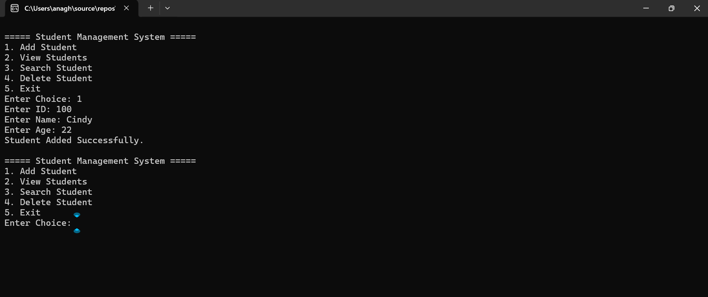
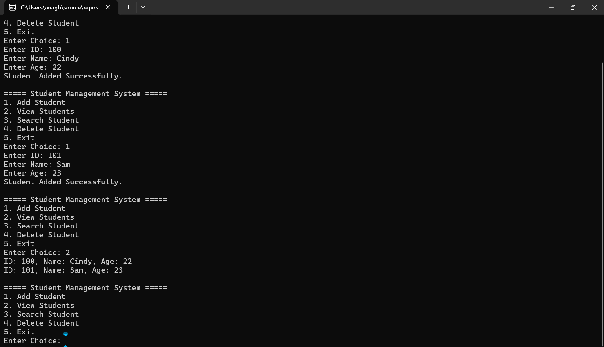
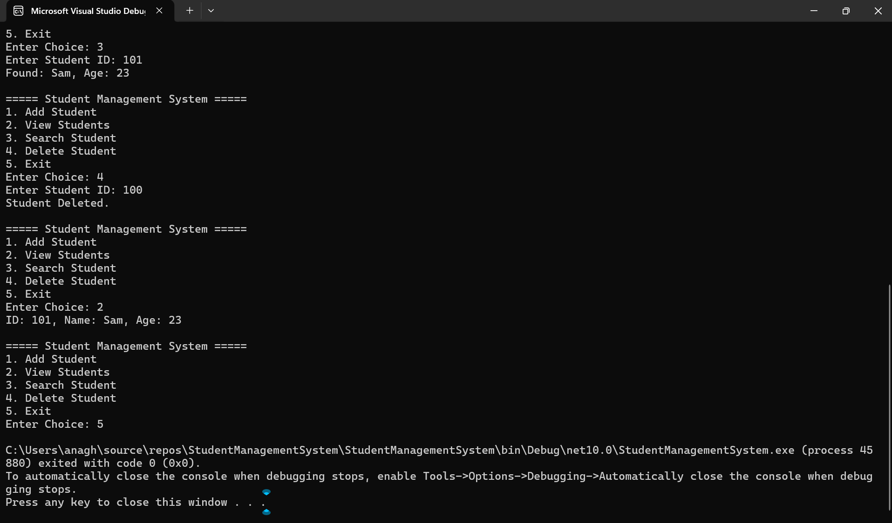

# Student Management System using C# and .NET

## Overview

Developed a **console-based Student Management System** using **C#** and **.NET**. The application enables users to manage student records through various operations while demonstrating **Object-Oriented Programming (OOP)** principles, **file handling** and **exception handling**.

---

##Features

- Add Student Records
- View Student Records
- Search Student by ID
- Delete Student Records
- Persistent Data Storage using File Handling
- Exception Handling for Invalid Inputs
- Menu-Driven Console Interface

---

## Technologies Used

- **C#**
- **.NET**
- **Object-Oriented Programming (OOP)**
- **Collections (List<T>)**
- **File Handling**
- **Exception Handling**

---

## Project Structure

### Student Class

The `Student` class stores student information such as:

- Student ID
- Student Name
- Student Age

### Functionalities

1. **Add Student**
   - Allows users to add new student records.

2. **View Students**
   - Displays all available student records.

3. **Search Student**
   - Searches for a student using their ID.

4. **Delete Student**
   - Removes a student record from the system.

5. **Data Persistence**
   - Saves student data to a file and reloads it when the application starts.

---

## Concepts Implemented

- Classes and Objects
- Encapsulation
- Collections
- Methods
- Loops
- Conditional Statements
- File Handling
- Exception Handling

---

## Screenshots

### Add Student

### View Students

### Search Student

### Delete and Exit

---

## Future Enhancements

- Database Integration using SQL Server
- ASP.NET Web Interface
- Student Record Update Functionality
- User Authentication and Authorization

---

## Learning Outcomes

Through this project, I gained practical experience in:

- C# Programming
- .NET Development
- Object-Oriented Programming
- File Handling
- Building Menu-Driven Applications
- Exception Handling

---

## Author

**Anagha Murali**
